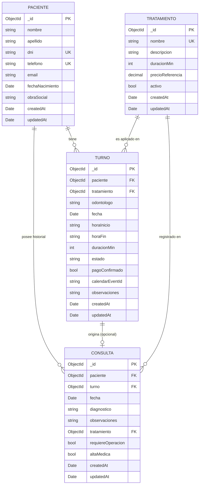

# 03 — Diagrama de Colecciones

**Trabajo Práctico — Base de Datos II**
**Sistema de Gestión de Turnos Odontológicos**

---

## Diagrama general (formato Mermaid)



---

## Diagrama textual con referencias

```
┌─────────────────────────────────────────────────┐
│  COLECCIÓN: pacientes                           │
│─────────────────────────────────────────────────│
│  _id (ObjectId, PK)                             │
│  nombre, apellido, dni (UNIQUE), telefono (UNIQ)│
│  email, fechaNacimiento, obraSocial             │
└────────────┬────────────────────────────────────┘
             │ ObjectId referencia
             │
             ▼
┌─────────────────────────────────────────────────┐
│  COLECCIÓN: turnos                              │
│─────────────────────────────────────────────────│
│  _id (ObjectId, PK)                             │
│  paciente      ───► ObjectId → pacientes._id    │
│  tratamiento   ───► ObjectId → tratamientos._id │
│  odontologo, fecha, horario{horaIni,horaFin},   │
│  duracionMin, estado, pagoConfirmado,           │
│  calendarEventId, observaciones                 │
└────────────┬────────────────────────────────────┘
             │ ObjectId referencia (sparse)
             │
             ▼
┌─────────────────────────────────────────────────┐
│  COLECCIÓN: consultas                           │
│─────────────────────────────────────────────────│
│  _id (ObjectId, PK)                             │
│  paciente      ───► ObjectId → pacientes._id    │
│  turno         ───► ObjectId → turnos._id       │
│  tratamiento   ───► ObjectId → tratamientos._id │
│  fecha, diagnostico, observaciones,             │
│  requiereOperacion, altaMedica                  │
└─────────────────────────────────────────────────┘

┌─────────────────────────────────────────────────┐
│  COLECCIÓN: tratamientos                        │
│─────────────────────────────────────────────────│
│  _id (ObjectId, PK)                             │
│  nombre (UNIQUE), descripcion,                  │
│  duracionMin, precioReferencia, activo          │
└─────────────────────────────────────────────────┘
```

---

## Cardinalidades

| Relación | Tipo | Implementación |
|---|---|---|
| `paciente` → `turnos` | 1 a N | `turno.paciente` = ObjectId |
| `tratamiento` → `turnos` | 1 a N | `turno.tratamiento` = ObjectId |
| `paciente` → `consultas` | 1 a N | `consulta.paciente` = ObjectId |
| `turno` → `consultas` | 1 a 0..1 | `consulta.turno` = ObjectId (sparse) |
| `tratamiento` → `consultas` | 1 a N | `consulta.tratamiento` = ObjectId |

---

## Índices definidos

```js
// pacientes
{ dni: 1 }      // unique
{ telefono: 1 } // unique
{ apellido: 1, nombre: 1 }

// tratamientos
{ nombre: 1 } // unique (declarado en el campo)

// turnos
{ fecha: 1, 'horario.horaInicio': 1 }
{ paciente: 1 }
{ estado: 1 }

// consultas
{ paciente: 1, fecha: -1 }
{ paciente: 1 }  // redundante pero útil
```

---

## Decisiones de modelado

1. **`horario` embebido en `turno`**: los horarios son siempre dos campos juntos, no se consultan ni modifican por separado. Embed simplifica y mejora la lectura.

2. **`turno` como referencia en `consulta` (no embebido)**: una consulta puede existir sin turno asociado (consulta espontánea), por eso es referencia sparse.

3. **`paciente` y `tratamiento` siempre referenciados (nunca embebidos)**: ambos se consultan, editan y validan de forma independiente, y se reutilizan en muchos turnos.

4. **`calendarEventId` almacenado en `turno`**: la integración con Calendar es 1:1 con el turno, así que guarda el ID del evento externo en el documento para poder eliminarlo al cancelar.
