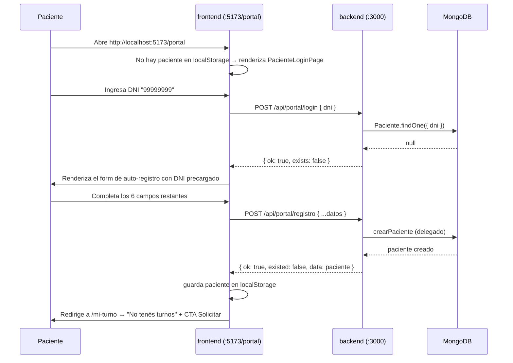
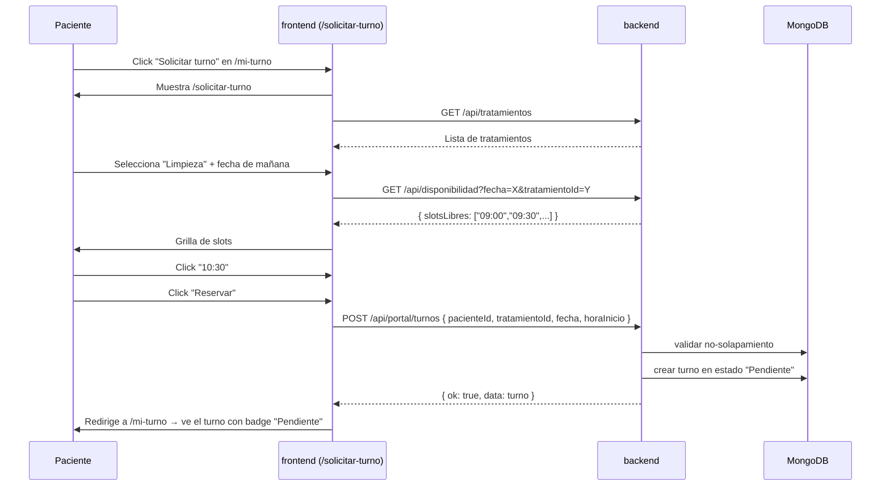

# Portal del Paciente — Documentación

**Trabajo Práctico — Base de Datos II**
Vista del paciente embebida en la misma SPA del consultorio (no es un proyecto aparte).

---

## 1. Propósito

El sistema principal (`frontend/`) cubre la vista del **odontólogo/recepción** (gestiona pacientes, turnos, consultas, agenda y reportes). Este documento describe la **vista del paciente**: tres rutas adicionales dentro de la misma SPA React, donde el paciente puede iniciar sesión con su DNI, auto-registrarse, ver y reservar turnos, y cancelarlos.

> **Nota histórica:** durante el desarrollo existió un proyecto aparte `frontend-paciente/` (segunda SPA en :5174). Se eliminó porque duplicaba lógica y obligaba a levantar dos dev servers. La vista del paciente quedó embebida en `/frontend` con rutas dedicadas que ocultan la navbar del odontólogo.

---

## 2. Decisiones de diseño

### 2.1 Autenticación simple por DNI

El paciente entra al portal escribiendo **solo su DNI**, sin contraseña. Si el DNI existe en la BD, se loguea; si no, se le pide completar el resto de sus datos para auto-registrarse.

> **Por qué es así:** mantener el alcance del TP sin convertir el sistema en uno empresarial. No se usa JWT, bcrypt, magic-link, ni OAuth. El "logueo" persiste el DNI y los datos del paciente en `localStorage` bajo la clave exportada como `PACIENTE_KEY` desde `PacienteLoginPage.jsx`.

### 2.2 Deduplicación con el panel del odontólogo

El portal reutiliza el endpoint `POST /api/pacientes` existente. Si un paciente fue dado de alta por el odontólogo, al paciente le basta con poner su DNI para entrar — no se crea duplicado. La regla TP de deduplicación por DNI/teléfono se respeta en ambos lados.

### 2.3 Reservas: el paciente elige slot, no hora exacta

El paciente ve una grilla de **slots libres** calculados por el backend (`GET /api/disponibilidad`). Toca uno, el sistema crea el turno en estado **Pendiente**. El odontólogo confirma el pago desde su panel y eso cambia el estado a **Confirmado** + crea evento en Google Calendar + envía email.

### 2.4 Cancelación libre

El paciente puede cancelar turnos en estado **Pendiente** o **Confirmado** desde `SolicitarTurnoPage`. No puede cancelar turnos ya **Atendidos** o **Cancelados**.

### 2.5 Cambio de turno

El paciente puede mover un turno Pendiente o Confirmado a otro slot disponible, sin tener que cancelar y volver a reservar (`PATCH /api/portal/turnos/:id/cambiar`).

### 2.6 Comprobante de pago (transferencia)

Si el método de pago es **Transferencia**, el portal permite subir el comprobante (base64) desde `SolicitarTurnoPage` para que la recepción lo valide.

### 2.7 Sin push en tiempo real

Cuando el odontólogo confirma un turno, **el paciente no recibe una notificación push** en el portal. Recibe el email (ya implementado en el backend). El portal muestra el cambio recién cuando el paciente refresca la vista.

> **Decisión consciente:** mantener simple. Sin WebSocket, sin SSE, sin polling. El email es la notificación oficial.

---

## 3. Arquitectura

```
+---------------------------------------------+
|  frontend (:5173) — única SPA                |
|  ------------------------------------------  |
|  Rutas del odontólogo (con NavBar):          |
|    /pacientes                                |
|    /turnos                                   |
|    /agenda                                   |
|    /consultas                                |
|                                              |
|  Rutas del paciente (sin NavBar):            |
|    /portal             ← login + auto-reg    |
|    /mi-turno           ← ver turno activo    |
|    /solicitar-turno    ← reservar/cambiar    |
+--------------------+------------------------+
                     |
                     |  /api/*
                     ▼
+------------------------------------------------------------+
|                  backend (Express :3000)                   |
|  +-------------+  +-------------+  +---------------------+ |
|  |  /pacientes |  |  /turnos    |  |  /portal            | |
|  +-------------+  +-------------+  |  - login            | |
|                                    |  - registro         | |
|                                    |  - mis-turnos       | |
|                                    |  - alias-pago       | |
|                                    |  - turnos (CRUD)    | |
|                                    +---------------------+ |
+----------------------------+-------------------------------+
                             │
                             ▼
                     +---------------+
                     |   MongoDB     |
                     +---------------+
```

### 3.1 Rutas del paciente (frontend/src)

```
frontend/src/
├── pages/
│   ├── PacienteLoginPage.jsx     # ruta /portal — login + auto-registro
│   ├── MiTurnoPage.jsx           # ruta /mi-turno — turno activo
│   └── SolicitarTurnoPage.jsx    # ruta /solicitar-turno — reservar/cambiar/cancelar/subir comprobante
├── components/
│   └── NavBar.jsx                # oculta el link de login y muestra "Mi turno" + logout cuando hay paciente en localStorage
├── api/client.js                 # portalApi.* (loginPorDni, registrar, misTurnos, getAliasPago, crearTurno, cancelarTurno, cambiarTurno, comprobante)
└── App.jsx                       # portalRoutes = ['/portal','/mi-turno','/solicitar-turno'] → oculta NavBar y container
```

`App.jsx` detecta las rutas del portal con `useLocation()` y omite la `NavBar` + el wrapper `.container`, dándole al paciente una UI limpia y mobile-first.

### 3.2 Backend (extensión, sin cambios al modelo)

Endpoints en `/api/portal/*` (ya existentes), que **delegan** en los controllers existentes:

| Endpoint | Lógica |
|---|---|
| `POST /api/portal/login` | `Paciente.findOne({ dni })`. Devuelve `{ exists: true, data }` o `{ exists: false }`. |
| `POST /api/portal/registro` | Reusa `crearPaciente` (controller existente). Mantiene deduplicación. |
| `GET /api/portal/mis-turnos?dni=...` | `Paciente.findOne({ dni })` → reusa `listarTurnos` con filtro `paciente=ID`. |
| `GET /api/portal/alias-pago` | Devuelve alias + titular configurados en backend. |
| `POST /api/portal/turnos` | Crea turno nuevo del paciente. |
| `PATCH /api/portal/turnos/:id/cancelar` | Cancela un turno propio. |
| `PATCH /api/portal/turnos/:id/cambiar` | Mueve un turno propio a otro slot. |
| `PATCH /api/portal/turnos/:id/comprobante` | Adjunta comprobante de pago (base64). |

`CLIENT_ORIGIN` en backend sigue aceptando lista CSV por si en el futuro se agregan otros frontends; con la unificación alcanza con `http://localhost:5173`.

---

## 4. Flujos end-to-end

### 4.1 Escenario A — Paciente nuevo (auto-registro)



### 4.2 Escenario B — Paciente existente

1. Paciente abre `/portal`.
2. Pone DNI.
3. `POST /api/portal/login` → `{ exists: true, data: paciente }`.
4. Se guarda en `localStorage` → redirige a `/mi-turno` con sus turnos ya cargados.

### 4.3 Escenario C — Reservar turno



### 4.4 Escenario D — Cancelar turno

1. Paciente en `/mi-turno`, click "Cancelar" en un turno Pendiente o Confirmado.
2. Confirmación en el modal.
3. `PATCH /api/portal/turnos/:id/cancelar` → backend cambia estado y elimina evento de Calendar (si existe).
4. Recargar lista → badge **Cancelado**.

### 4.5 Escenario E — Confirmación por el odontólogo

1. El odontólogo confirma el pago desde su panel (`/turnos`).
2. Backend actualiza estado, crea evento en Calendar, envía email.
3. El paciente **NO** recibe push. Ve el cambio al refrescar `/mi-turno` (botón del navegador o F5).
4. Email sigue siendo la notificación oficial.

---

## 5. Endpoints del portal

Base URL: `http://localhost:3000/api`

| Método | Ruta | Body | Respuesta |
|---|---|---|---|
| `POST` | `/portal/login` | `{ dni }` | `{ ok, exists, data? }` |
| `POST` | `/portal/registro` | `{ dni, nombre, apellido, telefono, email, fechaNacimiento, obraSocial }` | `{ ok, existed, data }` |
| `GET` | `/portal/mis-turnos?dni=X` | — | `{ ok, data: [turnos] }` |
| `GET` | `/portal/alias-pago` | — | `{ ok, data: { alias, titular } }` |
| `POST` | `/portal/turnos` | `{ pacienteId, tratamientoId, fecha, horaInicio, metodoPago? }` | `{ ok, data: turno }` |
| `PATCH` | `/portal/turnos/:id/cancelar` | `{ motivo? }` | `{ ok, data: turno }` |
| `PATCH` | `/portal/turnos/:id/cambiar` | `{ fecha, horaInicio, motivo? }` | `{ ok, data: turno }` |
| `PATCH` | `/portal/turnos/:id/comprobante` | `{ comprobanteBase64 }` | `{ ok, data: turno }` |

Validaciones aplicadas (vía `express-validator`):
- `dni`: 7-8 dígitos.
- `nombre`, `apellido`: 2-60 caracteres.
- `telefono`: 8-20 chars (`+`, `-`, dígitos, espacios).
- `email`: formato válido.
- `fechaNacimiento`: ISO8601, no futura.
- `obraSocial`: máx 80 chars.

Las mismas reglas del endpoint `POST /api/pacientes` (se reusa `crearPacienteValidator`).

---

## 6. Configuración y arranque

Con la unificación, alcanza con **2 terminales** en lugar de 3:

```bash
# Terminal 1
cd backend && npm run dev              # http://localhost:3000

# Terminal 2
cd frontend && npm run dev             # http://localhost:5173
# Dentro de :5173: el odontólogo usa /pacientes, /turnos, /agenda, /consultas
# y el paciente usa /portal, /mi-turno, /solicitar-turno (mismo dev server)
```

`frontend/vite.config.js` ya tiene el proxy `/api → :3000` configurado.

---

## 7. Limitaciones conocidas

| Limitación | Impacto | Mitigación |
|---|---|---|
| **Sin auth real** (DNI es la única credencial) | Cualquiera que conozca el DNI de un paciente puede ver sus turnos. | Documentado en README. Para producción: agregar JWT + password + 2FA. |
| **Sin push en tiempo real** | Cambios del odontólogo se ven solo al refrescar. | Email es la notificación oficial. Si el TP lo requiere, agregar SSE o polling. |
| **Sin recovery de sesión** | Si el paciente borra `localStorage`, debe volver a poner DNI. | No hay password reset. Aceptable para TP. |
| **Sin rate-limiting** | `/api/portal/login` puede ser consultado indefinidamente. | Mitigable con `express-rate-limit` si el profesor lo pide. |
| **Sin edición de perfil** | El paciente NO puede editar sus datos desde el portal. | Mantener simple; el odontólogo puede modificar desde su panel. |
| **CORS estricto** | Cualquier frontend no listado en `CLIENT_ORIGIN` queda bloqueado. | Apropiado para TP. En producción, revisar si se necesita lista más amplia. |

---

## 8. Smoke test específico del portal

End-to-end con backend corriendo y Mongo real:

```bash
# Con backend en :3000 y frontend en :5173:

# 1) Paciente nuevo
curl -X POST http://localhost:3000/api/portal/login \
     -H "Content-Type: application/json" \
     -d '{"dni":"99999999"}'
# → { exists: false }

curl -X POST http://localhost:3000/api/portal/registro \
     -H "Content-Type: application/json" \
     -d '{"dni":"99999999","nombre":"Test","apellido":"Portal","telefono":"+54 11 5555-9999","email":"test@x.com","fechaNacimiento":"1990-01-01","obraSocial":"OSDE"}'
# → { existed: false }

# 2) Login ahora existente
curl -X POST http://localhost:3000/api/portal/login \
     -H "Content-Type: application/json" \
     -d '{"dni":"99999999"}'
# → { exists: true, data: {...} }

# 3) Mis-turnos
curl "http://localhost:3000/api/portal/mis-turnos?dni=99999999"
# → { data: [] } al inicio

# 4) CORS check
curl -i http://localhost:3000/api/health -H "Origin: http://localhost:5173"
# → Access-Control-Allow-Origin: http://localhost:5173
```

**Validación visual (manual):**
1. Abrir `http://localhost:5173/portal` en el navegador.
2. Poner DNI "99999999" → si no existe, completar registro.
3. En `/mi-turno` click "Solicitar turno" → elegir tratamiento + fecha + slot → confirmar.
4. Verificar que el turno aparece en estado **Pendiente**.
5. En otra pestaña, abrir `http://localhost:5173/turnos` (panel odontólogo) → click "Confirmar pago" del turno nuevo.
6. Volver a `/mi-turno` → refrescar → el turno debe pasar a **Confirmado** (si Calendar y Mail están configurados, el email también llegó).

---

## 9. Extensiones posibles (no implementadas)

- **Edición de perfil** desde el portal: agregar `PUT /api/portal/mi-perfil` + endpoint en el frontend.
- **Historial de consultas**: reusar `GET /api/consultas?pacienteId=X` (sin cambios de backend).
- **Notificaciones en tiempo real**: SSE endpoint + EventSource en frontend.
- **Login con código por email**: agregar `POST /api/portal/login-otp` y guardar código en colección temporal.

Estas quedan fuera del alcance del TP por decisión explícita.
