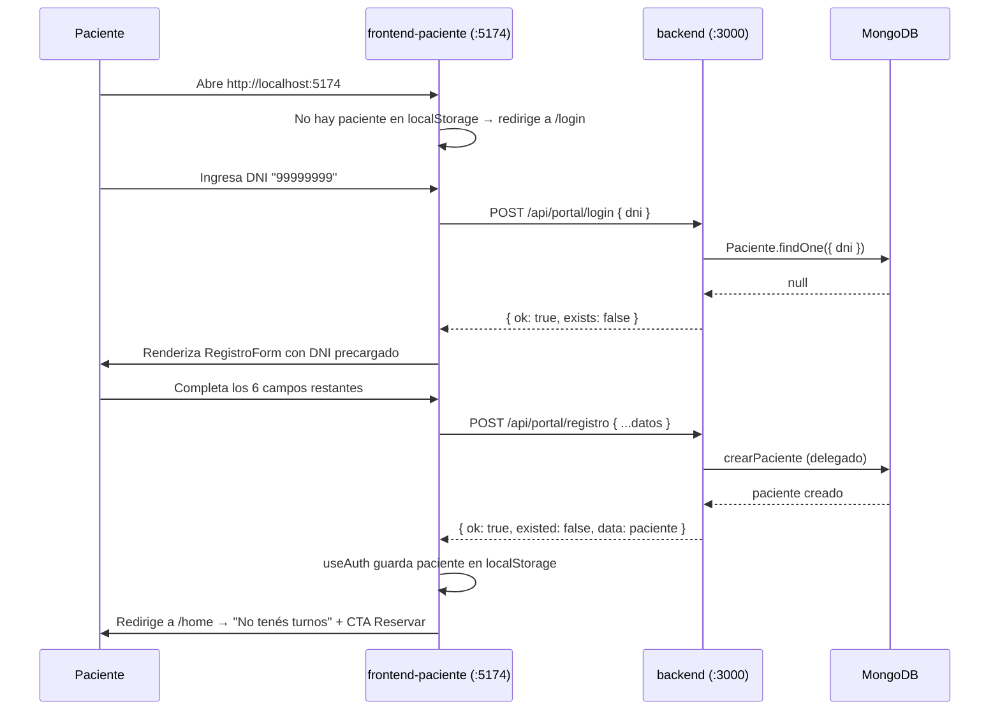
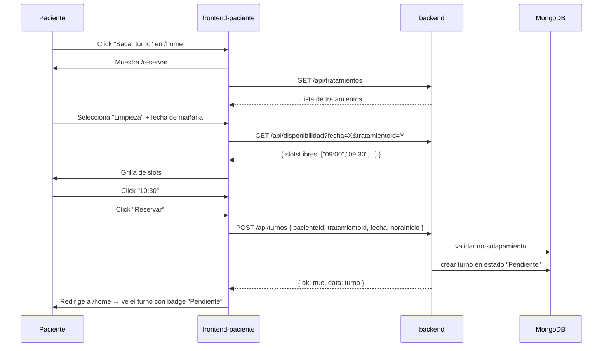

# Portal del Paciente — Documentación

**Trabajo Práctico — Base de Datos II**
Extiende el sistema principal con una segunda vista (SPA independiente) donde los pacientes pueden iniciar sesión con su DNI, auto-registrarse, ver y reservar turnos, y cancelarlos.

---

## 1. Propósito

El sistema original (`frontend/`) es la vista del **odontólogo/recepción**: gestiona pacientes, turnos, consultas, agenda y reportes. Este documento describe la **vista del paciente** (`frontend-paciente/`): una segunda SPA, completamente separada del frontend principal, que se conecta al **mismo backend** (`backend/`).

Ambas vistas conviven sin duplicar lógica: la del odontólogo sigue siendo la fuente de verdad para dar de alta pacientes manualmente o cargar consultas; la del paciente permite el alta automática y la autogestión de turnos.

---

## 2. Decisiones de diseño

### 2.1 Autenticación simple por DNI

El paciente entra al portal escribiendo **solo su DNI**, sin contraseña. Si el DNI existe en la BD, se loguea; si no, se le pide completar el resto de sus datos para auto-registrarse.

> **Por qué es así:** mantener el alcance del TP sin convertir el sistema en uno empresarial. No se usa JWT, bcrypt, magic-link, ni OAuth. El "logueo" persiste el DNI y los datos del paciente en `localStorage`.

### 2.2 Deduplicación con el panel del odontólogo

El portal reutiliza el endpoint `POST /api/pacientes` existente. Si un paciente fue dado de alta por el odontólogo, al paciente le basta con poner su DNI para entrar — no se crea duplicado. La regla TP de deduplicación por DNI/teléfono se respeta en ambos lados.

### 2.3 Reservas: el paciente elige slot, no hora exacta

El paciente ve una grilla de **slots libres** calculados por el backend (`GET /api/disponibilidad`). Toca uno, el sistema crea el turno en estado **Pendiente**. El odontólogo confirma el pago desde su panel y eso cambia el estado a **Confirmado** + crea evento en Google Calendar + envía email.

### 2.4 Cancelación libre

El paciente puede cancelar turnos en estado **Pendiente** o **Confirmado**. No puede cancelar turnos ya **Atendidos** o **Cancelados**.

### 2.5 Sin push en tiempo real

Cuando el odontólogo confirma un turno, **el paciente no recibe una notificación push** en el portal. Recibe el email (ya implementado en el backend). El portal muestra el cambio recién cuando el paciente refresca `/home`.

> **Decisión consciente:** mantener simple. Sin WebSocket, sin SSE, sin polling. El email es la notificación oficial.

---

## 3. Arquitectura

```
+-------------------------+         +-------------------------+
|  frontend-paciente (:5174)|       |  frontend (:5173)        |
|  - LoginForm / Registro   |       |  - Pacientes             |
|  - HomePage / Reservar    |       |  - Turnos                |
|  - MiPerfil               |       |  - Agenda                |
+------------+--------------+         +------------+------------+
             |                                   |
             |  /api/*                           |  /api/*
             ▼                                   ▼
+------------------------------------------------------------+
|                  backend (Express :3000)                   |
|  +-------------+  +-------------+  +---------------------+ |
|  |  /pacientes |  |  /turnos    |  |  /portal (NUEVO)    | |
|  +-------------+  +-------------+  |  - login            | |
|                                    |  - registro         | |
|                                    |  - mis-turnos       | |
|                                    +---------------------+ |
+----------------------------+-------------------------------+
                             │
                             ▼
                     +---------------+
                     |   MongoDB     |
                     +---------------+
```

### Backend (extensión, sin cambios al modelo)

Tres endpoints nuevos en `/api/portal/*`, que **delegan** en los controllers existentes:

| Endpoint | Lógica |
|---|---|
| `POST /api/portal/login` | `Paciente.findOne({ dni })`. Devuelve `{ exists: true, data }` o `{ exists: false }`. |
| `POST /api/portal/registro` | Reusa `crearPaciente` (controller existente). Mantiene deduplicación. |
| `GET /api/portal/mis-turnos?dni=...` | `Paciente.findOne({ dni })` → reusa `listarTurnos` con filtro `paciente=ID`. |

Más el cambio en `app.js`: `CLIENT_ORIGIN` ahora acepta **lista CSV** (`http://localhost:5173,http://localhost:5174`) y se valida cada origen contra esa lista.

### Frontend (`frontend-paciente/`)

Standalone: React 18 + Vite 5 + React Router 6. Mismas versiones que `frontend/`. Comparte solo el backend (vía proxy Vite :5174 → :3000).

```
frontend-paciente/
├── package.json
├── vite.config.js                ← port 5174, proxy /api → :3000
├── index.html
└── src/
    ├── main.jsx                  ← BrowserRouter + App
    ├── App.jsx                   ← Rutas + guards de auth
    ├── styles.css                ← Mobile-first, container 600px
    ├── api/client.js             ← Funciones fetch centralizadas
    ├── hooks/
    │   ├── useAuth.js            ← Login/registro/logout + localStorage
    │   ├── useMisTurnos.js       ← Lista turnos del paciente
    │   └── useDisponibilidad.js  ← Slots libres
    ├── components/
    │   ├── Header.jsx            ← Logo + saludo + logout
    │   ├── LoginForm.jsx
    │   ├── RegistroForm.jsx
    │   ├── NuevoTurnoForm.jsx
    │   ├── DisponibilidadGrid.jsx
    │   ├── TurnoCardPaciente.jsx
    │   ├── MisTurnosList.jsx
    │   ├── MiPerfil.jsx
    │   └── ConfirmDialog.jsx
    └── pages/
        ├── LoginPage.jsx
        ├── HomePage.jsx
        ├── ReservarPage.jsx
        └── PerfilPage.jsx
```

---

## 4. Flujos end-to-end

### 4.1 Escenario A — Paciente nuevo (auto-registro)



### 4.2 Escenario B — Paciente existente

1. Paciente abre :5174.
2. Pone DNI.
3. `POST /api/portal/login` → `{ exists: true, data: paciente }`.
4. `useAuth` guarda en `localStorage` → redirige a `/home` con sus turnos ya cargados.

### 4.3 Escenario C — Reservar turno



### 4.4 Escenario D — Cancelar turno

1. Paciente en `/home`, click "Cancelar" en un turno Pendiente o Confirmado.
2. `ConfirmDialog` → confirma.
3. `PATCH /api/turnos/:id/cancelar` → backend cambia estado y elimina evento de Calendar (si existe).
4. Recargar lista → badge **Cancelado**.

### 4.5 Escenario E — Confirmación por el odontólogo

1. El odontólogo confirma el pago desde su panel (`frontend/`).
2. Backend actualiza estado, crea evento en Calendar, envía email.
3. El paciente **NO** recibe push. Ve el cambio al refrescar `/home` (botón del navegador o F5).
4. Email sigue siendo la notificación oficial.

---

## 5. Endpoints del portal

Base URL: `http://localhost:3000/api`

| Método | Ruta | Body | Respuesta |
|---|---|---|---|
| `POST` | `/portal/login` | `{ dni }` | `{ ok, exists, data? }` |
| `POST` | `/portal/registro` | `{ dni, nombre, apellido, telefono, email, fechaNacimiento, obraSocial }` | `{ ok, existed, data }` |
| `GET` | `/portal/mis-turnos?dni=X` | — | `{ ok, data: [turnos] }` |

Validaciones aplicadas (vía `express-validator`):
- `dni`: 7-8 dígitos.
- `nombre`, `apellido`: 2-60 caracteres.
- `telefono`: 8-20 chars (`+`, `-`, dígitos, espacios).
- `email`: formato válido.
- `fechaNacimiento`: ISO8601, no futura.
- `obraSocial`: máx 80 chars.

Las mismas reglas del endpoint `POST /api/pacientes` (se reusa `crearPacienteValidator`).

---

## 6. Configuración y arranque

### 6.1 CORS multi-origen

En `backend/.env`:

```env
CLIENT_ORIGIN=http://localhost:5173,http://localhost:5174
```

El backend parsea esto como CSV y valida cada `Origin` del request contra la lista. Cualquier origen fuera de la lista responde HTTP 500 con `"Origen no permitido por CORS: ..."`.

### 6.2 Arranque de los tres servicios

Necesitás **3 terminales** (o usar `concurrently` en el root):

```bash
# Terminal 1
cd backend && npm run dev              # http://localhost:3000

# Terminal 2
cd frontend && npm run dev             # http://localhost:5173 (odontólogo)

# Terminal 3
cd frontend-paciente && npm run dev    # http://localhost:5174 (pacientes)
```

`frontend-paciente/vite.config.js` ya tiene el proxy `/api → :3000` configurado.

---

## 7. Limitaciones conocidas

| Limitación | Impacto | Mitigación |
|---|---|---|
| **Sin auth real** (DNI es la única credencial) | Cualquiera que conozca el DNI de un paciente puede ver sus turnos. | Documentado en README. Para producción: agregar JWT + password + 2FA. |
| **Sin push en tiempo real** | Cambios del odontólogo se ven solo al refrescar. | Email es la notificación oficial. Si el TP lo requiere, agregar SSE o polling. |
| **Sin recovery de sesión** | Si el paciente borra `localStorage`, debe volver a poner DNI. | No hay password reset. Aceptable para TP. |
| **Sin rate-limiting** | `/api/portal/login` puede ser consultado indefinidamente. | Mitigable con `express-rate-limit` si el profesor lo pide. |
| **Sin edición de perfil** | El paciente NO puede editar sus datos desde el portal. | Mantener simple; el odontólogo puede modificar desde su panel. |
| **CORS estricto** | Cualquier frontend no listado en `CLIENT_ORIGIN` queda bloqueado. | Apropiado para TP. En producción, revisar si se necesita lista más amplia. |

---

## 8. Smoke test específico del portal

End-to-end con backend corriendo y Mongo real:

```bash
# Con backend en :3000 y frontend-paciente en :5174:

# 1) Paciente nuevo
curl -X POST http://localhost:3000/api/portal/login \
     -H "Content-Type: application/json" \
     -d '{"dni":"99999999"}'
# → { exists: false }

curl -X POST http://localhost:3000/api/portal/registro \
     -H "Content-Type: application/json" \
     -d '{"dni":"99999999","nombre":"Test","apellido":"Portal","telefono":"+54 11 5555-9999","email":"test@x.com","fechaNacimiento":"1990-01-01","obraSocial":"OSDE"}'
# → { existed: false }

# 2) Login ahora existente
curl -X POST http://localhost:3000/api/portal/login \
     -H "Content-Type: application/json" \
     -d '{"dni":"99999999"}'
# → { exists: true, data: {...} }

# 3) Mis-turnos
curl "http://localhost:3000/api/portal/mis-turnos?dni=99999999"
# → { data: [] } al inicio

# 4) CORS check
curl -i http://localhost:3000/api/health -H "Origin: http://localhost:5174"
# → Access-Control-Allow-Origin: http://localhost:5174
```

**Validación visual (manual):**
1. Abrir `http://localhost:5174` en el navegador.
2. Poner DNI "99999999" → si no existe, completar registro.
3. En `/home` click "Sacar turno" → elegir tratamiento + fecha + slot → confirmar.
4. Verificar que el turno aparece en estado **Pendiente**.
5. En otra pestaña, abrir `http://localhost:5173` (panel odontólogo) → ir a `/turnos` → click "Confirmar pago" del turno nuevo.
6. Volver al portal :5174 → refrescar `/home` → el turno debe pasar a **Confirmado** (si Calendar y Mail están configurados, el email también llegó).

---

## 9. Extensiones posibles (no implementadas)

- **Edición de perfil** desde el portal: agregar `PUT /api/portal/mi-perfil` + endpoint en el frontend.
- **Historial de consultas**: reusar `GET /api/consultas?pacienteId=X` (sin cambios de backend).
- **Notificaciones en tiempo real**: SSE endpoint + EventSource en frontend.
- **Login con código por email**: agregar `POST /api/portal/login-otp` y guardar código en colección temporal.

Estas quedan fuera del alcance del TP por decisión explícita.